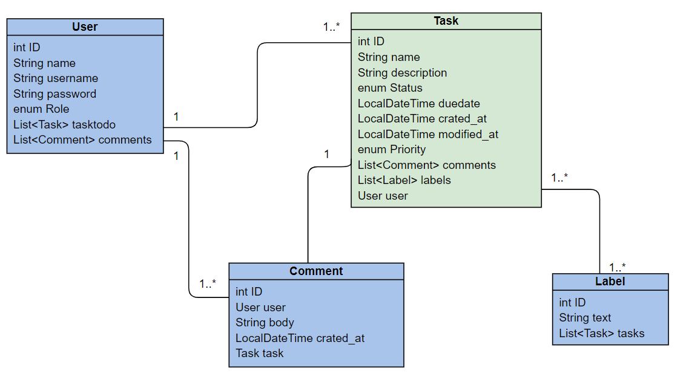
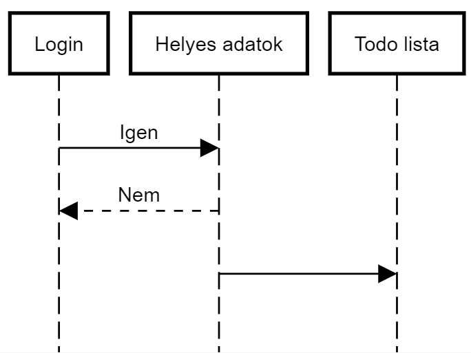

# Vállalati - todo
Alkalmazások fejlesztése tantárgy keretein belül fejlesztett beadandó feladat
Gyugyi Péter - EZEL5H Kiss Bence - I10EJA

## Feladat funkcionális követelményei:
1. Felhasználó regisztrálni tud a rendszerbe
	1. Regisztráció sikeres a kötelező mezők kitöltésével. Ügyelni kell a felhasználónak, hogy a mezőket megfelelő adatokkal töltse ki.
2. Felhasználó be tud lépni a rendszerbe
	1. Már regisztrált felhasználó be tud lépni a rendszerbe, ha megadja a regisztráció során megadott nevét, valamint jelszavát. Hibás felhasználó vagy jelszó esetén hibaüzenet.
3. Bejelentkezett felhasználó láthatja a vállalaton belüli felhasználók, feladatait
	1. Felhasználó tud szűrni a vállalaton belül feladatokra, valamint a többi felhasználóra
4. Vállalati feladatok hozzáadása, valamint törlése
	1. Felhasználó képes feladat hozzáadására, törlésére
5. Felhasználó hozzáadhat kommentet a feladatokhoz, megtekintheti a feladatot, változtathat a határidején, szűrhet feladatokra

## Feladat nem funkcionális követelményei:
1. Átlátható, letisztult, egyértelmű felhasználói felület
2. Az alkalmazás a fent említett funkcionális követelményeknek megfelel
3. Jelszavak biztonságos tárolása

## Szakterületi fogalomjegyzék:
 - Felhasználó: Egy munkatárs aki regisztráció során hitelesítette magát.
 - Hozzáadás: Új feladat felvétele.
 - Feladat: Elvégzendő tennivaló
 - Feladatok Listája: A feladatok összesége.
 - Feladatok státusza lehet: 
		1. New (ezt a feladatot nem rég adták hozzá, még nincs vele foglalkozva)
		2. In Work (ezt a feladatot az adott felhasználó már elkezdte)
		3. On Hold (ezt a feladatot az adott felhasználó elkezdte, de most épp másik feladattal foglalkozik ezért várakozó státuszra rakta)
		4. Done (ezt a feladatot az adott felhasználó befejezte)

## Szerepkörök: 
1. Megfelelő szerepkörök biztosítása a vállalat munkafolyamatainak pontos elvégzésére.
 	- Csapatvezető és csapattag kapcsolat 
	- Csapatvezetőnek lehetősége van feladat törlésére, csapattagnak nincs hozzá joga
	
## Adatbázisterv:
1.	User -> A felhasználó, aki használja az alkalmazást. Ha a user egy csapatvezető, törölhet is feladatot.
2.	Task -> A kiírt feladat. Ez tartalmazza a feladat státuszát, információkat a módosításokról és a feladat prioritási szintjét is.
3.	Comment -> A feladatokhoz hozzá lehet szólni, ha valami nem egyértelmű a csapattagok számára.
4.	Label -> Plusz információ a feladatokhoz.
	

### User:
1.	id – azonosító
2.	name – a felhasználó teljes neve
3.	username – a felhasználó választott neve a belépéshez
4.	password – a felhasználó jelszava a belépéshez
5.	role – a felhasználó szerepköre, ez lehet csapatvezető és csapattag
6.	tasktodo – a felhasználó feladatai
7.	comments – a felhasználó kommentjei

### Task:
1.	id – azonosító
2.	name – a feladat neve
3.	description – a feladat leírása
4.	status – a feladat állapota, ez lehet ’new’, ’in_work’, ’on_hold’, ’done’
5.	duedate – a feladat határideje
6.	created_at – a feladat létrehozásának ideje
7.	modified_at – a feladat legutóbbi módosításának ideje
8.	priority – a feladat fontosságát jelzi, lehet ’low’, ’medium’, ’high’
9.	comments – a feladathoz fűzött kommentek
10.	labels – a feladathoz tartozó plusz információk
11.	user – a felhasználó, aki a feladatot csinálja

# Comment:
1.	id – azonosító
2.	user – a felhasználó, aki írta a kommentet
3.	body – a komment tartalma
4.	created_at – a komment posztolásának ideje
5.	task – a feladat, amihez a komment tartozik

### Label:
1.	id – azonosító
2.	text – a címke tartalma
3.	tasks – a feladatok, amiket érint

### Kapcsolatok:
-	Egy felhasználó több feladatot csinálhat egyidőben
-	Egy felhasználó több kommentet írhat
-	Egy feladathoz több komment érkezhet
-	Több különböző feladathoz tartozhat ugyan az a címke, és más címkék is

## Könyvtárstruktúra:

-	A ’controller’ tartalmazza a végpontokat
-	a ’model’ az adatbázishoz tartozó osztályokat
-	ezeket a ’repository’ és a ’service’ kezeli
-	a ’security’ a biztonsági beállításokat tartalmazza

## Végpontok:
-	POST (workers/””)
-	DELETE (delete/{id})
-	POST (login)
-	GET (””)			(a userek listája)
-	GET ({id})
-	GET (task/{id})
-	POST (addtask/{id})
-	POST (removetask/{id})
-	GET (tasks/””)			(a taskok listája)
-	GET (tasks/{id})
-	POST (tasks/””)			(task hozzáadása)
-	PATCH (tasks/status/{id})
-	PATCH (tasks/priority/{id})
-	PATCH (tasks/duedate/{id})
-	PATCH (tasks/worker/{id})
-	PATCH (tasks/description/{id})
-	DELETE (tasks/{id})
-	POST (tasks/comments/{id})
-	POST (tasks/removecomment/{id})

### A login leírása:
Két kitölthető mező és egy gomb jelenik meg. Az első mezőben meg kell adni a username-et, a másodikban a hozzá tartozó password-öt, ezután a ’Sign in’ gombbal megpróbálhatunk belépni. Ha a username-password párt helyesen adtuk meg, beléptet a rendszerben, különben hibaüzenetet kapunk és nem léphetünk tovább.

